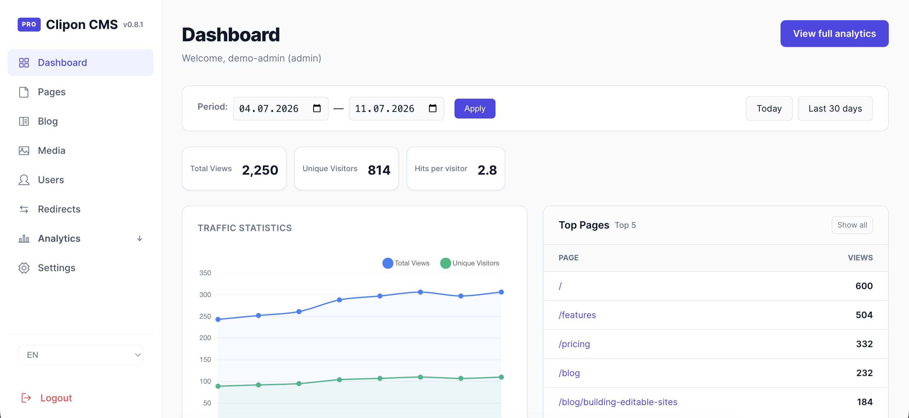

# Clipon CMS

Clipon CMS is a lightweight flat-file CMS for existing PHP/HTML sites. It adds inline editing, page and blog management, media uploads, a core administrator account, redirects, analytics, primary-language routing, and optional modules without requiring MySQL.
The CMS runtime is PHP-based.



## Demo

Try the live demo: [demo.clipon-cms.com](https://demo.clipon-cms.com/)

## Features

- Inline editing for elements marked with `class="clipon"`.
- Page CRUD with SEO fields, homepage selection, active state, history, and restore.
- Blog posts with directories, localized tags, thumbnails, excerpts, shortcodes, and pagination.
- Media manager with folders, uploads, image/video insertion, and alt text. Localized alt text requires the optional Multilang module.
- 301/302 redirects and route-map rebuilds.
- Core administrator account with profile/password management, sessions, CSRF protection, and login throttling. Multiple users, restricted roles, and granular permissions require an optional user-management module.
- Local analytics with privacy/basic mode, cookie consent for full analytics, bot filtering, GeoIP, UTM/referrer data, page-based conversions, custom conversion types, and PRO custom conversion events.
- Base single-primary-language support. Translated content, localized slugs, alternate links, and multilingual sitemap integration require the optional Multilang module; language-switcher and localized-URL helpers must be supplied by that module or the site template and are not guaranteed Core globals.
- Modular architecture with module providers, hooks, a service registry, runtime module loading, and PRO gates.

## Requirements

- PHP 8.0 or newer.
- Apache or Nginx with PHP support.
- Writable runtime directories: `content/`, `config/`, `data/`, `logs/`, `modules/`, `templates/`, and `assets/uploads/`.
- Optional GeoIP/license/update downloads require outbound HTTPS and PHP cURL or enabled URL streams.

Node.js, Composer, and MySQL are not required for normal CMS operation.

## Runtime And Storage

Clipon keeps system code under `clipon/` and site-owned state in separate runtime directories, allowing the system directory to be upgraded without replacing site content and configuration:

- `content/` — pages, blog content, and history.
- `config/` — settings, routes, directories, license/update state, and media metadata.
- `data/` — analytics, GeoIP data, blog indexes, and locks.
- `logs/` — authentication, CSRF, update, migration, and application logs.
- `modules/` — installed optional modules.
- `templates/` — site templates.
- `assets/uploads/` — uploaded media.

Structured runtime data is stored as guarded flat files, commonly JSON payloads inside `.php` files beginning with `<?php die(); ?>`. Runtime directories must not be served directly; use the included Apache rules or the Nginx configuration from the installation guide.

## Editing, Routing, And SEO

Inline editing uses the editor bundle included with the CMS. Elements marked with `class="clipon"` are identified by `data-key`, `id`, or an automatic `clipon_<index>` fallback, and stored content is sanitized before rendering.

The front controller and route map provide clean URLs, page/blog routes, redirects, active/inactive state, and sitemap generation. Active public routes use URLs without a trailing slash: `GET` and `HEAD` requests for a trailing-slash variant receive a permanent `301` redirect to the canonical URL, with the query string and installation base path preserved. The home page `/` is unchanged. Localized slugs and multilingual alternate URLs are available only when the optional Multilang module is active.

## Admin, Analytics, And Modules

The admin area is available under `clipon/admin/`. Admin pages and mutation APIs are session-bound and use permission checks and CSRF validation; explicitly public endpoints such as analytics event tracking are documented separately.

Core analytics stores data locally under `data/analytics/` and supports privacy/basic collection without a visitor cookie. Consent-enabled full mode adds visitor/session metrics such as exit pages, bounce rate, and conversion deduplication. Core supports page-based conversions and custom conversion types; browser-triggered custom conversion events, extended reports, funnels, and attribution require the optional PRO analytics module.

Optional modules are discovered from `modules/<module_id>/module.php`, may provide metadata through `manifest.php`, register services, and attach hooks during boot.

## Quick Start

Copy the CMS files to a PHP host. Runtime directories are not pre-populated in the release: either create the directories listed above and make them writable by PHP, or temporarily allow PHP to create them in the site root during setup. Then open:

```text
/clipon/setup.php
```

After setup creates the directories, remove PHP write access from the site root while leaving the runtime directories writable. See the installation guide for the complete permission workflow.

See the documents in `docs/` for the public CMS guides.

## Repository Map

- `index.php` - public front controller.
- `.htaccess` - Apache rewrite rules for the CMS root.
- `clipon/` - CMS system code.
- `docs/` - public CMS documentation.

## Documentation

- [Installation and web-server configuration](docs/INSTALLATION.md)
- [Configuration](docs/CONFIGURATION.md)
- [Backup and restore](docs/BACKUP_AND_RESTORE.md)
- [Troubleshooting](docs/TROUBLESHOOTING.md)
- [Security model](docs/SECURITY_MODEL.md)
- [Privacy](docs/PRIVACY.md)
- [Analytics](docs/ANALYTICS_GUIDE.md)
- [Blog](docs/BLOG_GUIDE.md)
- [Seonix integration](docs/SEONIX_INTEGRATION.md)
- [Multilang](docs/MULTILANG_GUIDE.md)
- [Storage](docs/STORAGE.md)
- [Upgrade](docs/UPGRADE.md)
- [Bundled browser dependencies](docs/EXTERNAL_DEPENDENCIES.md)

## Contributing

Feedback, bug reports, and improvement ideas are very welcome. Open an issue, start a discussion, or send a pull request if you want to help make Clipon CMS better.

If you find the project useful, please star the repository on GitHub: [Lincoln012015/Clipon-CMS](https://github.com/Lincoln012015/Clipon-CMS)

## License

Clipon CMS core source files and public documentation in this repository are licensed under the Mozilla Public License, v. 2.0. See [LICENSE](LICENSE).


